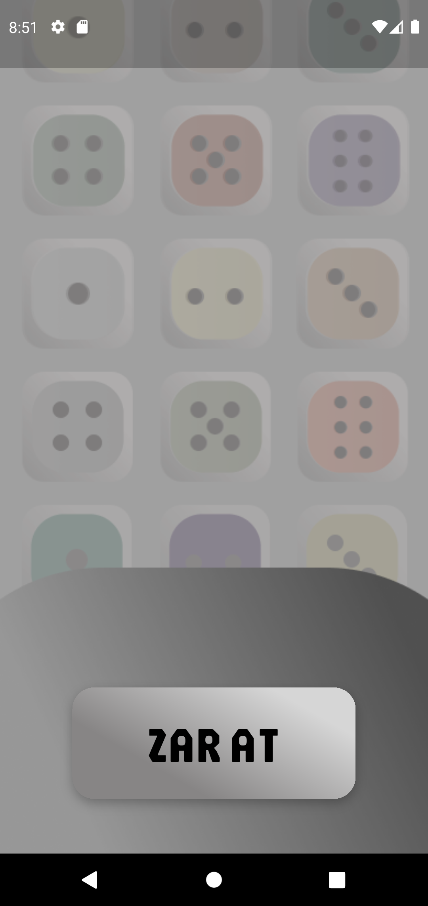

# 🎲 Zar Atma Uygulaması (Flutter)

Bu proje, Flutter kullanılarak geliştirilmiş **zar atma uygulamasıdır**.  
Kullanıcı, minimum ve maksimum değerleri seçerek kendi aralığında zar atabilir(1-24).  
Uygulama üç ana ekrandan oluşmaktadır:

1. **Welcome Screen (Ana Ekran)**  
2. **Range Selection Screen (Aralık Seçimi)**  
3. **Dice Game Screen (Zar Atma Ekranı)**  

---

## 🚀 Özellikler
- 🎨 Özel arayüz tasarımı ve arka plan görselleri  
- 🔢 Minimum ve maksimum değer aralığı seçme  
- 🎲 Seçilen aralıkta rastgele zar atma  
- 🖼️ Zar atıldığında arka plan animasyonlu geçiş  

---

## 📸 Ekran Görüntüleri

### 🏠 Welcome Screen
Kullanıcı uygulamayı açtığında karşısına çıkan ekran.  
`ZAR AT` butonuna basarak oyuna geçiş yapılır.  



---

### 🔢 Range Selection Screen
Kullanıcı minimum ve maksimum değerleri seçerek zar aralığını belirler.  


---

### 🎲 Dice Game Screen
Ekrana dokunarak zar atılır.  
Arka plan rastgele değişir ve seçilen aralıkta sonuç döner.  


---

## 📂 Proje Yapısı

```plaintext
lib/
│── main.dart                # Uygulama başlangıç noktası
│── welcome_screen.dart      # Ana ekran
│── range_selection_screen.dart # Aralık seçim ekranı
│── dice_game_screen.dart    # Zar atma ekranı
│── background_gradients.dart # Arka plan yönetimi
assets/
│── images/                  # Arka plan ve ekran görselleri

## ▶️ Çalıştırma

1. Bu projeyi bilgisayarına klonla:
```bash
git clone https...
```
2. Gerekli paketleri yükle:
```bash
flutter pub get
```

3. Uygulamayı çalıştır:
```bash
flutter run
```

## 🛠️ Kullanılan Teknolojiler

- Flutter (Dart SDK)
- Google Fonts (özel yazı tipleri)
- Material Design
- Figma

