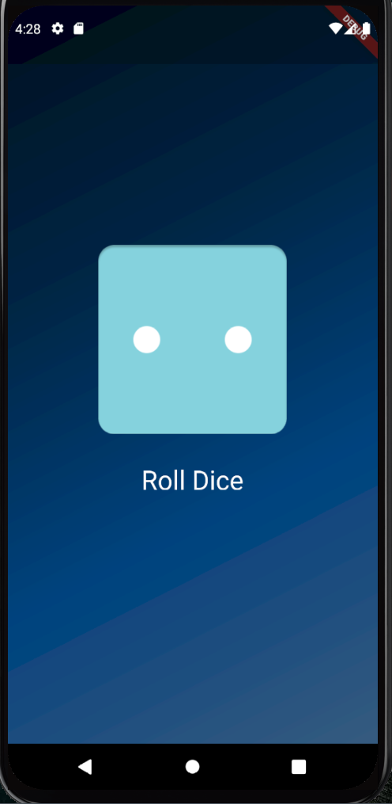

# 🎲 Roll Dice App (Flutter)

Basit bir **Flutter** projesi: ekrandaki butona tıklayınca 1 ile 6 arasında rastgele bir zar görüntüsü gösterir.  

## 📸 Ekran Görüntüsü



## 🚀 Özellikler
- Flutter ile mobil uygulama geliştirme örneği  
- Arka planda **gradient tasarımı**  
- Tıklama ile **rastgele zar atma (1-6)**  
- Asset (resim) kullanımı  


## 📂 Proje Yapısı
lib/
├── main.dart # Uygulamanın giriş noktası
├── styled_text.dart # Özel text widget
├── gradient_container.dart # Arka plan gradient container
└── dice_roller.dart # Zar atma işlemi ve UI

## ▶️ Çalıştırma
Projeyi çalıştırmak için:  

```bash
flutter pub get
flutter run
```

## 📦 Gereksinimler
- Flutter SDK
- Android Studio veya VS Code (Flutter eklentileri ile)
- Bir emulator veya gerçek cihaz

## 🎯 Amaç

Bu proje Flutter öğrenirken StatefulWidget, setState(), random sayı üretimi ve widget ağacı gibi temel kavramları pekiştirmek için hazırlanmıştır.


##🌱 Daha Gelişmiş Versiyon

Bu projenin daha gelişmiş versiyonu new_version adlı branch altında bulunmaktadır.
